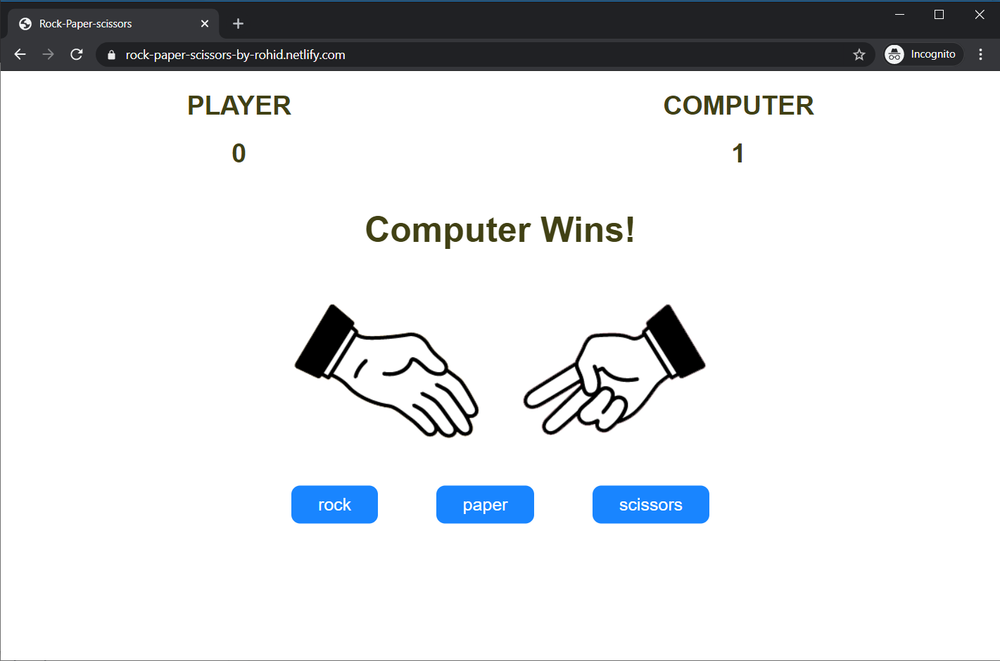

<p align="center">

  <h1 align="center">Rock Paper Scissors</h1>

  <p align="center">
     Rock Paper Scissors Game
    <br />
    <br />
    <a href="https://rock-paper-scissors-by-rohid.netlify.com/">Play Now</a>
    ·
    <a href="https://github.com/rohid-hub/Rock-Paper-Scissors/issues">Report Bug</a>
    ·
    <a href="https://github.com/rohid-hub/Rock-Paper-Scissors/issues">Request Feature</a>
  </p>
</p>


<!-- TABLE OF CONTENTS -->
## Table of Contents

* [About the Project](#about-the-project)
  * [Built With](#built-with)
* [Getting Started](#getting-started)
  * [Installation](#installation)
* [Contact](#contact)


<!-- ABOUT THE PROJECT -->
## About The Project

<p align="center"><p>

This is a Rock Paper Scissors game

### Built With
* JavaScript
* HTML
* CSS/SCSS


<!-- GETTING STARTED -->
## Getting Started

Here's how you can use this project

### Installation

1. Just clone the repo and you are all set :-)
```sh
git clone git@github.com:rohid-hub/Rock-Paper-Scissors.git
```


<!-- CONTACT -->
## Contact

Rohidul Islam - [email](rohidul677@gmail.com)

Github Link: [rohid-hub](https://github.com/rohid-hub)